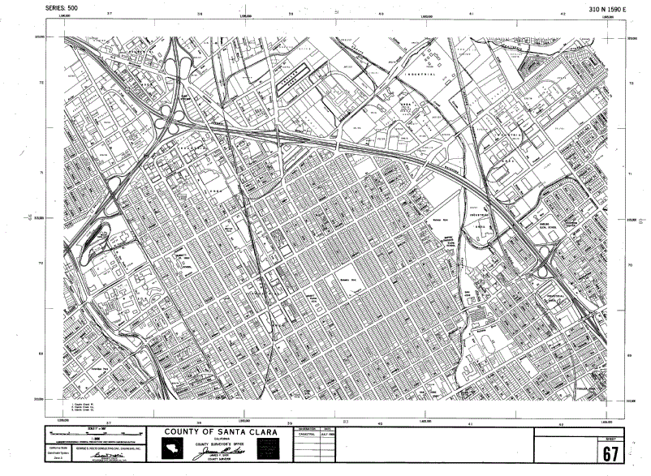
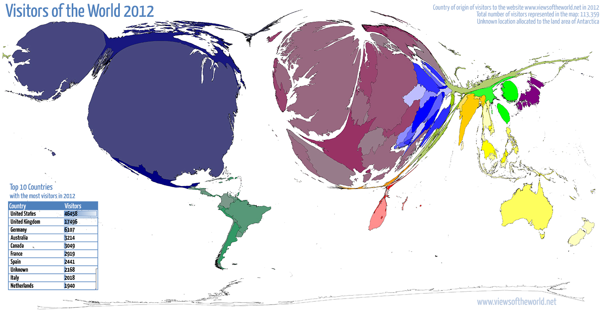
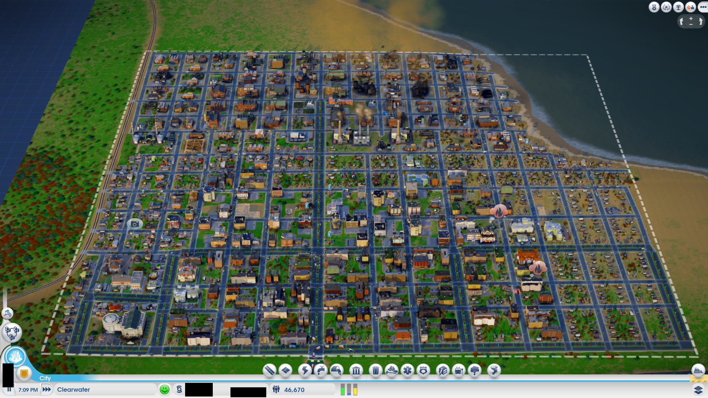
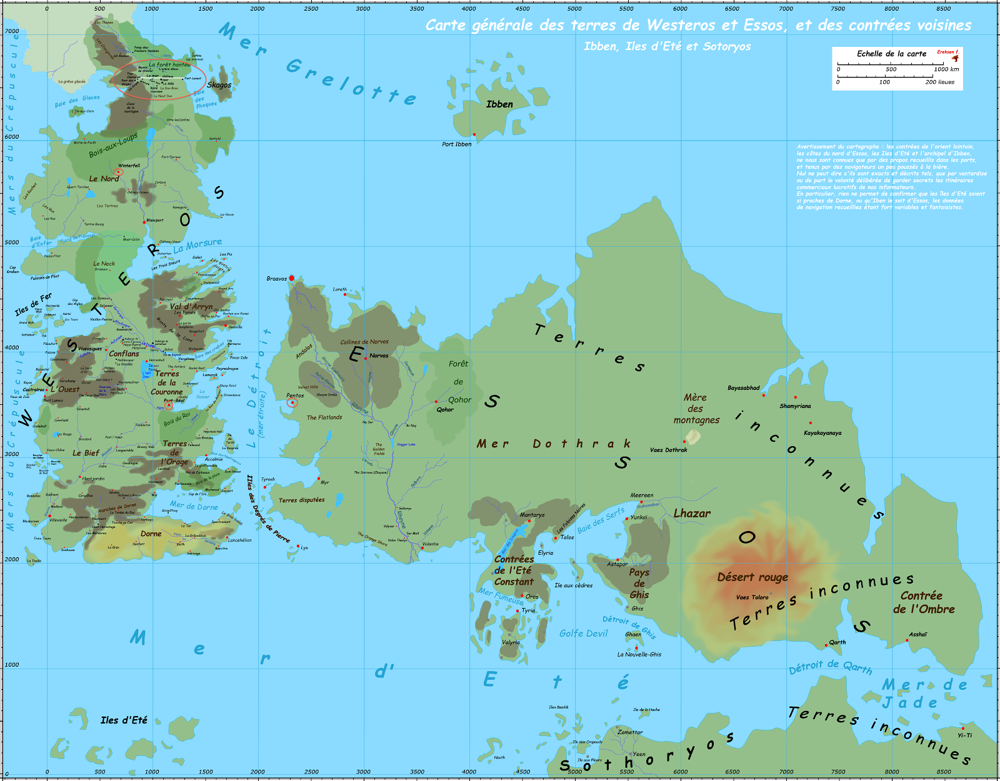
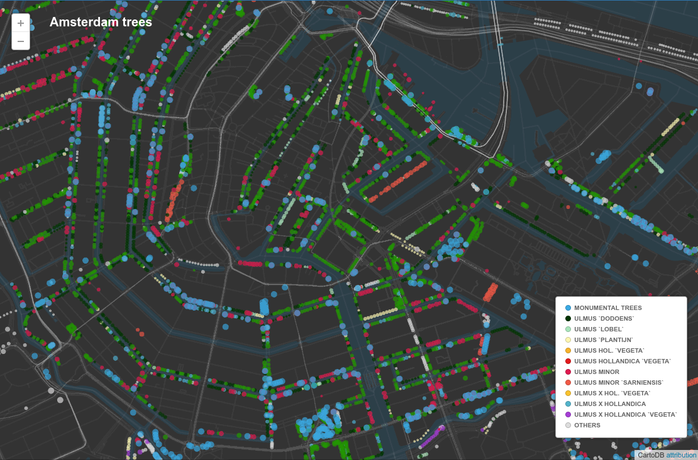
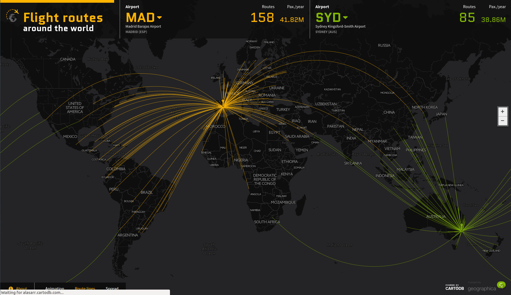
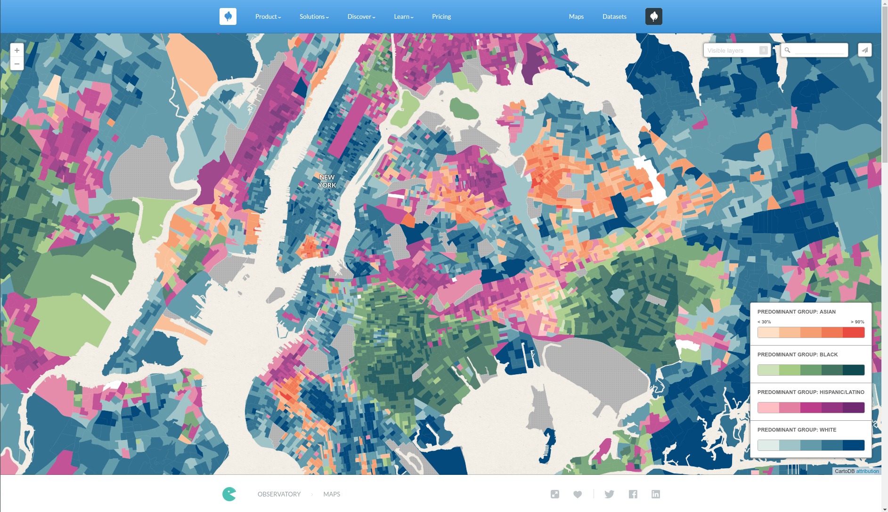
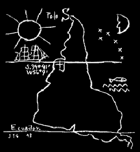

Mapas
============

Jorge · [@xurxosanz](http://twitter.com/xurxosanz)

5 de mayo de 2016

___

## Agenda

* Qué es un mapa: elementos, realidad y ficción, propósito
* Historia: protomapas, edad media, s. XIX y XX (historia del metro)
* Mapas en 2016: Google Maps, OSM, Internet
* Ejemplos de mapas (de las ráfagas)

---

# Qué es un mapa
___

> Representación simbólica de relaciones entre objetos
___

Note:
Sí, hace falta una definición tan vaga porque un mapa puede ser muchas cosas!
___

Note:
Porque un mapa puede ser algo tan preciso y detallado como un
mapa de la propiedad.
___

Note:
O algo mucho más simbólico como un mapa del metro
___

Note:
O quedarse a medio camino entre la realidad y la simbolización
___

Note:
Pueden ser en papel y creados despacio y con mucho cuidado
___

Note:
O en tres dimensiones, creados sobre la marcha mientras juegas en Interent
___

Note:
Y por supuesto de mundos completamente imaginarios
¿alguien sabe de dónde es este mapa?
___

## Elementos
___

### Puntos

___

### Líneas

___

### Polígonos

___

### Textos

___

## Elementos: ayudas

* Cuadrícula
* Norte
* Leyenda
* Cajetín
* ¿Dragones?

---

# Historia

___

## Primeros mapas

___

## Edad Media

___

## S XIX y XX

___

## Cómo se definió el metro

---

# Mapas en 2016

___

## Google Maps

___

## OSM
___

## Internet

---

# Ejemplos

---