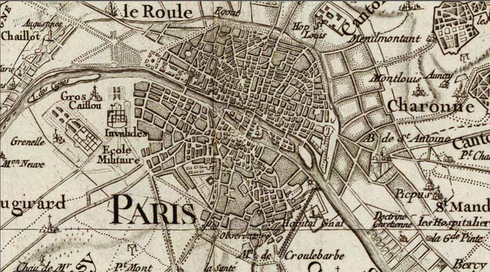

Mapas: explorando lo desconocido
===================================

Jorge · [@xurxosanz](http://twitter.com/xurxosanz)

5 de mayo de 2016

___

## Agenda

* Qué es un mapa: elementos, realidad y ficción, propósito
* Historia: protomapas, edad media, s. XIX y XX (historia del metro)
* Mapas en 2016: Google Maps, OSM, Internet
* Ejemplos de mapas (de las ráfagas)

---

# Qué es un mapa
___

> Representación simbólica  
> de relaciones entre objetos
___

[&raquo;](http://giphy.com/gifs/fpXxIjftmkk9y)

Note:
Sí, hace falta una definición tan vaga porque un mapa puede ser muchas cosas!
___

[&raquo;](http://sclcountysurveyor.blogspot.com.es/2012/10/cadastral-maps-and-county-grid-numbers.html)

Note:
Porque un mapa puede ser algo tan preciso y detallado como un
mapa de la propiedad.
___

[&raquo;](https://tfl.gov.uk/maps/track/tube)

Note:
O algo mucho más simbólico como un mapa del metro
___

[&raquo;](http://www.esri.com/news/arcuser/0110/cartograms.html)

Note:
O quedarse a medio camino entre la realidad y la simbolización
___

[&raquo;]((http://secondat.blogspot.com.es/2010/07/george-and-agnes.html)

Note:
Pueden ser en papel y creados despacio y con mucho cuidado
___

[&raquo;](http://www.playnation.de/spiele-news/simcity/community-verlangt-nach-groesseren-maps-id46796.html)

Note:
O en tres dimensiones, creados sobre la marcha mientras juegas en Interent
___

[&raquo;](http://www.mediumscreen.com/2013/03/game-of-thrones-le-trone-de-fer.html)

Note:
Y por supuesto de mundos completamente imaginarios
¿alguien sabe de dónde es este mapa?
___

[&raquo;](https://decolonialatlas.wordpress.com/2016/04/12/inuit-cartography/)
___

## Elementos: contenido
___

### Puntos<!-- .element class="slide-title" -->
<!-- .slide: data-background="imgs/elements-points.png"-->

Note:
[&raquo;](https://team.cartodb.com/u/piensaenpixel/viz/a3b27bb6-5b80-11e5-b5f5-0e4fddd5de28/public_map)
___

### Líneas<!-- .element class="slide-title" -->
<!-- .slide: data-background="imgs/elements-lines.png"-->

Note:
[&raquo;](http://flightroutes.geographica.gs/)
___

### Polígonos<!-- .element class="slide-title" -->
<!-- .slide: data-background="imgs/elements-polygons.png"-->

Note:
[&raquo;](https://observatory.cartodb.com/viz/2efcbf5c-080a-11e6-ac50-0e31c9be1b51/public_map)
___

### Textos<!-- .element class="slide-title" -->
<!-- .slide: data-background="imgs/elements-texts.png"-->

Note:
[&raquo;](http://maps.stamen.com/toner/#17/40.07427/-2.13282)
___

## Elementos: ayudas
___

### Leyenda

[&raquo;](http://ocean.floridamarine.org/boating_guides/florida_keys/products/interactive_maps/Middle_Keys_Side_A.html)
___

### Cuadrícula

[&raquo;](http://hubpages.com/education/Materials-and-Directions-for-Teaching-Latitude-and-Longitude-With-Battleship-Game)
___

### Escala

[&raquo;](http://www.outdoorblueprint.com/read/how-to-read-a-topographic-map/)
___

### Cajetín

[&raquo;](http://dtandina.blogspot.com.es/2014/08/cajetin-y-angulos.html)
___

### ¿Dragones?

[&raquo;](https://en.uit.no/forskning/forskningsgrupper/gruppe?p_document_id=344565)
___

### Norte

[&raquo;](http://www.clker.com/clipart-white-compass-rose-24.html)

___

### Un momento
___

### ¿Por qué los mapas  tienen que apuntar al norte?<!-- .element class="slide-title" -->
<!-- .slide: data-background="imgs/sideb.jpg"-->

Note:
[&raquo;](http://www.odt.org/southupmaps.htm)
___

### ¿Y por qué el este tiene que estar a la derecha?<!-- .element class="slide-title" -->
<!-- .slide: data-background="imgs/west-east.jpg"-->

Note:
[&raquo;](http://brightside.me/article/what-the-world-looks-like-to-different-people-as-shown-by-seven-utterly-fascinating-maps-44505/)
___

### ¿Y por qué no el este hacia arriba?

[&raquo;](https://www.wikiwand.com/en/Bianco_world_map)
___

<!-- .slide: data-background="imgs/upside_down_map.png" -->

Note:
[&raquo;](https://xkcd.com/1500/)
___

---

# Historia
___

## Primeros mapas
___

### Mapamundi babilonio ~600 a.C.

[&raquo;](https://www.wikiwand.com/en/Babylonian_Map_of_the_World)

Note:
Este es uno de los más más antiguos del que se tiene noticia, es un mapa
babilonio en arcilla representando de forma simbólica los territorios
conocidos para sus habitantes
___

### Mapa de las Islas Marshall ~300 a.C.

 <!-- .element style="width:60%;"-->

[&raquo;](https://www.reddit.com/r/MapPorn/comments/1cgcqb/stick_chart_used_by_polynesian_seafarers_to/)

Note:
Estos eran los mapas usados por los habitantes de las Islas Marshall en el
Pacífico Sur para orientarse y encontrar pequeñas islas en grandes extensiones
de océano. Los europeos utilizaron este conocimiento para colonizar esos
territorios en el siglo XVIII.
___

## Edad Media
___

## Mapa de T en O

<!-- .element style="width:50%;"-->

[&raquo;](https://es.wikipedia.org/wiki/Mapa_de_T_en_O)

Note:
El mapa de T en O muestra arriba Asia, por donde sale el sol, dejando Europa
y África abajo y separadas por el mar Mediterraneo, el Nilo, el Mar Negro y
el río Don. En el centro se situaba a Jerusalén y la O externa representa el
mundo como un disco perfecto.
___

## Mapa de T en O

<!-- .element style="width:50%;"-->

Note:
Una representación siguiendo el mismo concepto pero en lugar de simbólica, con
todo el detalle del que eran capaces en el siglo XIV.

___

## Mapa de Mateo de París (S XIII)

<!-- .element style="width:40%;"-->

[&raquo;](https://www.wikiwand.com/en/Matthew_Paris)
___

## Mapa de Cresques (S XIV)<!-- .element class="slide-title" -->
<!-- .slide: data-background="imgs/catalan-atlas.jpg"-->

Note:
Abraham Cresques y su hijo recibieron el encargo de Juan I de Aragón de crear
un Atlas del mundo conocido. [&raquo;](http://www.passion-histoire.net/viewtopic.php?f=52&t=35960)
___

## Atlas de Ortelius (S XVI)<!-- .element class="slide-title" -->
<!-- .slide: data-background="imgs/ortelius.jpg"-->

Note:
Este es considerado como el primer atlas moderno, con 70 mapas que cubrían
el mundo explorado hasta entonces.
___

## Ortelius: Mapa de España<!-- .element class="slide-title" -->
<!-- .slide: data-background="imgs/ortelius-spain.jpg"-->

___

## Mapa de Joan Blaeu (S XVII) <!-- .element class="slide-title" -->
<!-- .slide: data-background="imgs/blaeu.jpg"-->

___

## Mapas de Cassini (S XVIII) <!-- .element class="slide-title" -->
<!-- .slide: data-background="imgs/cassini-all.png"-->

Note:
Cuatro generaciones de cartógrafos, los Cassini, produjeron el primer mapa
preciso de Francia elaborado mediante triangulación y mediciones precisas
en el terreno.
[&raquo;](http://www.davidrumsey.com/blog/2009/10/11/national-survey-of-france-1750-1815)
___

## Detalle de París

___

## S XIX y XX

___

## Cómo se definió el metro

---

# Mapas en 2016

___

## Google Maps

___

## OSM
___

## Internet

---

# Ejemplos

---