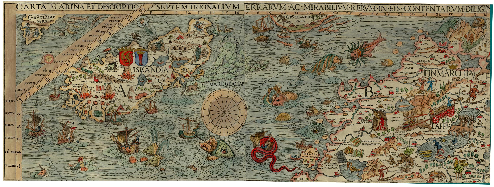

Mapas: explorando lo desconocido
===================================

Jorge · [@xurxosanz](http://twitter.com/xurxosanz)

5 de mayo de 2016

___

## Agenda

* Qué es un mapa: elementos, realidad y ficción, propósito
* Historia: protomapas, edad media, s. XIX y XX (historia del metro)
* Mapas en 2016: Google Maps, OSM, Internet
* Ejemplos de mapas (de las ráfagas)

---

# Qué es un mapa
___

> Representación simbólica  
> de relaciones entre objetos
___

[&raquo;](http://giphy.com/gifs/fpXxIjftmkk9y)

Note:
Sí, hace falta una definición tan vaga porque un mapa puede ser muchas cosas!
___

[&raquo;](http://sclcountysurveyor.blogspot.com.es/2012/10/cadastral-maps-and-county-grid-numbers.html)

Note:
Porque un mapa puede ser algo tan preciso y detallado como un
mapa de la propiedad.
___

[&raquo;](https://tfl.gov.uk/maps/track/tube)

Note:
O algo mucho más simbólico como un mapa del metro
___

[&raquo;](http://www.esri.com/news/arcuser/0110/cartograms.html)

Note:
O quedarse a medio camino entre la realidad y la simbolización
___

[&raquo;]((http://secondat.blogspot.com.es/2010/07/george-and-agnes.html))

Note:
Pueden ser en papel y creados despacio y con mucho cuidado
___

[&raquo;](http://www.playnation.de/spiele-news/simcity/community-verlangt-nach-groesseren-maps-id46796.html)

Note:
O en tres dimensiones, creados sobre la marcha mientras juegas en Interent
___

[&raquo;](http://www.mediumscreen.com/2013/03/game-of-thrones-le-trone-de-fer.html)

Note:
Y por supuesto de mundos completamente imaginarios
¿alguien sabe de dónde es este mapa?
___

[&raquo;](https://decolonialatlas.wordpress.com/2016/04/12/inuit-cartography/)
___

## Elementos: contenido
___

### Puntos

[&raquo;](https://team.cartodb.com/u/piensaenpixel/viz/a3b27bb6-5b80-11e5-b5f5-0e4fddd5de28/public_map)
___

### Líneas

[&raquo;](http://flightroutes.geographica.gs/)
___

### Polígonos

[&raquo;](https://observatory.cartodb.com/viz/2efcbf5c-080a-11e6-ac50-0e31c9be1b51/public_map)
___

### Textos

[&raquo;](http://maps.stamen.com/toner/#17/40.07427/-2.13282)
___

## Elementos: ayudas
___

### Leyenda

[&raquo;](http://ocean.floridamarine.org/boating_guides/florida_keys/products/interactive_maps/Middle_Keys_Side_A.html)
___

### Cuadrícula

[&raquo;](http://hubpages.com/education/Materials-and-Directions-for-Teaching-Latitude-and-Longitude-With-Battleship-Game)
___

### Escala

[&raquo;](http://www.outdoorblueprint.com/read/how-to-read-a-topographic-map/)
___

### Norte

[&raquo;](http://www.clker.com/clipart-white-compass-rose-24.html)

___

### Un momento
___

### ¿Por qué los mapas  tienen que apuntar al norte?

[&raquo;](http://www.odt.org/southupmaps.htm)
___

### ¿Y por qué el este tiene que estar a la derecha?

[&raquo;](http://brightside.me/article/what-the-world-looks-like-to-different-people-as-shown-by-seven-utterly-fascinating-maps-44505/)
___

### ¿Y el norte hacia arriba?

[&raquo;](https://www.wikiwand.com/en/Bianco_world_map)
___

[&raquo;](https://xkcd.com/1500/)
___

___

### Cajetín

[&raquo;](http://dtandina.blogspot.com.es/2014/08/cajetin-y-angulos.html)
___

### ¿Dragones?

[&raquo;](https://en.uit.no/forskning/forskningsgrupper/gruppe?p_document_id=344565)

---

# Historia

___

## Primeros mapas

___

## Edad Media

___

## S XIX y XX

___

## Cómo se definió el metro

---

# Mapas en 2016

___

## Google Maps

___

## OSM
___

## Internet

---

# Ejemplos

---