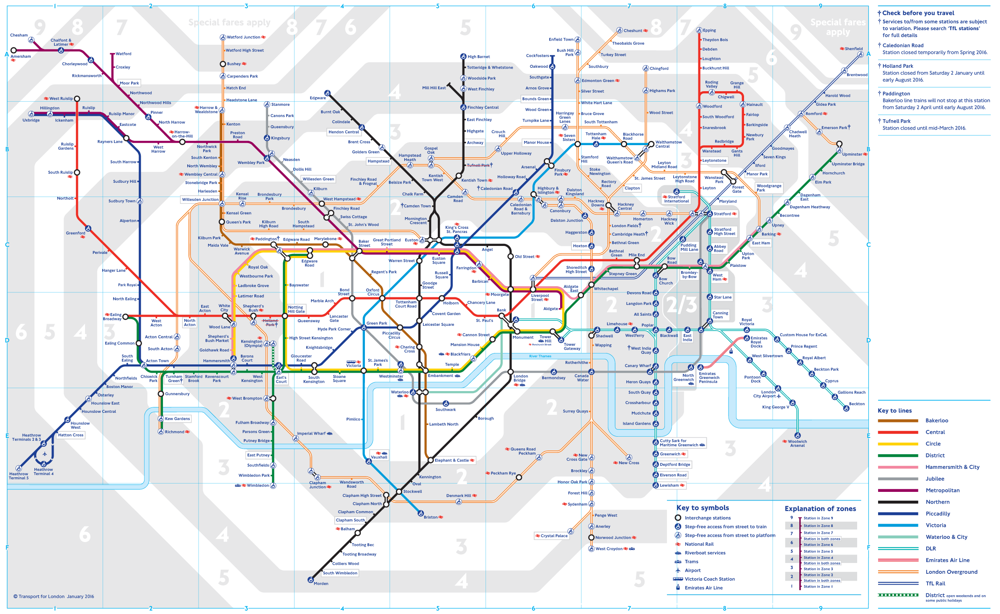

Mapas: explorando lo desconocido
===================================

Jorge Sanz · [@xurxosanz](http://twitter.com/xurxosanz)

5 de mayo de 2016

http://bit.ly/mapas-fernando-zobel

___

## Agenda

* Qué es un mapa
* Algunos mapas históricos interesantes
* La cartografía en 2016
* Ejemplos de mapas que me gustan

---

# Qué es un mapa
___

> Representación simbólica de relaciones   entre objetos espaciales
___

[&raquo;](http://giphy.com/gifs/fpXxIjftmkk9y)

Note:
Sí, hace falta una definición tan vaga porque un mapa puede ser muchas cosas!
___

[&raquo;](http://sclcountysurveyor.blogspot.com.es/2012/10/cadastral-maps-and-county-grid-numbers.html)

Note:
Porque un mapa puede ser algo tan preciso y detallado como un
mapa de la propiedad.
___

[&raquo;](https://tfl.gov.uk/maps/track/tube)

Note:
O algo mucho más simbólico como un mapa del metro, donde si os fijáis en la
forma del río, intenta tener cierta similitud con la realidad para ayudar
a establecer las relaciones espaciales.
___

[&raquo;](http://www.viewsoftheworld.net/)

Note:
O quedarse a medio camino entre la realidad y la simbolización. Un cartograma
es un mapa en el que el tamaño de las formas se establece en función de una
variable. En este cartograma cuanto más grande es el país, más turistas recibió.
___

[&raquo;]((http://secondat.blogspot.com.es/2010/07/george-and-agnes.html)

Note:
Pueden ser en papel y creados despacio y con mucho cuidado, como estos
cartógrafos de los años 70.
___

[&raquo;](http://www.playnation.de/spiele-news/simcity/community-verlangt-nach-groesseren-maps-id46796.html)

Note:
O en tres dimensiones, creados sobre la marcha mientras juegas en Interent
___

<!-- .element style="width:60%;"-->

[&raquo;](http://sermountaingoat.co.uk/map/index.php)

Note:
Y por supuesto de mundos completamente imaginarios
¿alguien sabe de dónde es este mapa?
___

[&raquo;](https://decolonialatlas.wordpress.com/2016/04/12/inuit-cartography/)

Note:
Incluso mapas portables (sin baterías) como estos mapas tallados en madera por los
Inuit, que sirven para reconocer la costa.
___

## Elementos: contenido

Note:
Vamos a repasar qué elementos forman un mapa, empezando por lo más importante:
su contenido.
___

### Puntos<!-- .element class="slide-title" -->
<!-- .slide: data-background="imgs/elements-points.png"-->

Note:
Elementos puntuales sirven para marcar lugares especiales como en este ejemplo
donde cada punto simboliza un árbol de la ciudad de Amsterdam, usando el color
para distinguir las diferentes variedades.
[&raquo;](https://team.cartodb.com/u/piensaenpixel/viz/a3b27bb6-5b80-11e5-b5f5-0e4fddd5de28/public_map)
___

### Líneas<!-- .element class="slide-title" -->
<!-- .slide: data-background="imgs/elements-lines.png"-->

Note:
El siguiente tipo es la línea, que sirve para indicar trayectos, o formas que
tienen un recorrido como las carreteras y los ríos. En este caso vemos líneas
que dibujan las rutas aéreas desde los aeropuertos de Madrid y Sydney.
[&raquo;](http://flightroutes.geographica.gs/)
___

### Polígonos<!-- .element class="slide-title" -->
<!-- .slide: data-background="imgs/elements-polygons.png"-->

Note:
Finalmente como tipo geométrico tenemos el área o polígono, que expresa una
característica que cubre cierto territorio. En este caso vemos en diferentes
tonalidades las razas predominantes en las manzanas de la ciudad de Nueva York.
[&raquo;](https://observatory.cartodb.com/viz/2efcbf5c-080a-11e6-ac50-0e31c9be1b51/public_map)
___

### Textos<!-- .element class="slide-title" -->
<!-- .slide: data-background="imgs/elements-texts.png"-->

Note:
Los textos se colocan encima del resto del contenido y ayudan a reconocer e
identificarlos. Sirven para informar de nombres de lugares o del valor que estamos
representando.
[&raquo;](http://maps.stamen.com/toner/#17/40.07427/-2.13282)
___

## Elementos: ayudas

Note:
Además de la información geográfica propiamente dicha, un mapa necesita de algunas
ayudas para que podamos comprender de forma más rápida su significado.
___

### Leyenda

[&raquo;](http://ocean.floridamarine.org/boating_guides/florida_keys/products/interactive_maps/Middle_Keys_Side_A.html)

Note:
La leyenda es una guía para entender los símbolos del mapa. Para cada tipo de
símbolo se indica su significado, normalmente con un texto.
___

### Cuadrícula

[&raquo;](http://hubpages.com/education/Materials-and-Directions-for-Teaching-Latitude-and-Longitude-With-Battleship-Game)

Note:
La cuadrícula es una serie de líneas que representan los meridianos y los
paralelos o líneas con x o y constante, dependiendo del tipo de mapa. Sirven
para dar una mejor sensación de las dimensiones de los objetos y para ubicarnos
mejor.
___

### Escala

[&raquo;](http://www.outdoorblueprint.com/read/how-to-read-a-topographic-map/)

Note:
La escala, gráfica o numérica, sirve para entender la relación que hay entre los
elementos del mapa y la realidad.
___

### Cajetín

[&raquo;](http://dtandina.blogspot.com.es/2014/08/cajetin-y-angulos.html)

Note:
El cajetín es un espacio del mapa que recoge todo tipo de información textual
adicional como títulos, leyenda, aclaraciones adicionales, etc.
___

### ¿Dragones?

[&raquo;](https://en.uit.no/forskning/forskningsgrupper/gruppe?p_document_id=344565)

Note:
Sí, en la edad media se dibujaban todo tipo de _adornos_ que hacían los mapas
más atractivos y servían para adoctrinar en creencias como que en los confines
del mundo habitaban monstruos mitológicos. ¡Quedaban estupendos en los mapas!
___

### Norte

[&raquo;](http://www.clker.com/clipart-white-compass-rose-24.html)

Note:
Cuando no tenemos una cuadrícula que nos guíe, lo habitual es disponer de un
símbolo que nos ayude a indicar la dirección en la que se encuentra el Norte.
___

### Un momento

Note:
¿Pero por qué hace falta una flecha, los mapas no apuntan siempre al norte?
___

### ¿Por qué los mapas  tienen que apuntar al norte?<!-- .element class="slide-title" -->
<!-- .slide: data-background="imgs/sideb.jpg"-->

Note:
El hecho de que la mayoría de los mapas apunten al norte no obliga a ello,
no hay ninguna obligación científica a hacerlo y podemos tener mapas que miren
al sur.
[&raquo;](http://www.odt.org/southupmaps.htm)
___

### ¿Y por qué el este tiene que estar a la derecha?<!-- .element class="slide-title" -->
<!-- .slide: data-background="imgs/west-east.jpg"-->

Note:
De hecho los podemos voltear también horizontalmente y dejar el oeste a nuestra
derecha.
[&raquo;](http://brightside.me/article/what-the-world-looks-like-to-different-people-as-shown-by-seven-utterly-fascinating-maps-44505/)
___

### ¿Y por qué no el este hacia arriba?

[&raquo;](https://www.wikiwand.com/en/Bianco_world_map)

Note:
De hecho durante un tiempo hubo la costumbre de poner el este hacia arriba,
dejando de esa manera los mapas orientados hacia donde sale el sol.
___

<!-- .slide: data-background="imgs/upside_down_map.png" -->

Note:
Puestos a jugar ¡¡podemos rotar los continentes individualmente!!
[&raquo;](https://xkcd.com/1500/)
___

---

# Algunos mapas históricos interesantes

Note:
Vamos a viajar por unos cuantos siglos de historia de la cartografía a través
de 11 mapas que son relevantes.
___

## Primeros mapas
___

### Mapamundi babilonio ~600 a.C.

[&raquo;](https://www.wikiwand.com/en/Babylonian_Map_of_the_World)

Note:
Este es uno de los más más antiguos del que se tiene noticia, es un mapa
babilonio en arcilla representando de forma simbólica los territorios
conocidos para sus habitantes
___

### Mapa de las Islas Marshall ~300 a.C.

 <!-- .element style="width:60%;"-->

[&raquo;](https://www.reddit.com/r/MapPorn/comments/1cgcqb/stick_chart_used_by_polynesian_seafarers_to/)

Note:
Estos eran los mapas usados por los habitantes de las Islas Marshall en el
Pacífico Sur para orientarse y encontrar pequeñas islas en grandes extensiones
de océano. Los europeos utilizaron este conocimiento para colonizar esos
territorios en el siglo XVIII.
___

## Edad Media
___

## Mapa de T en O (S XII)

<!-- .element style="width:50%;"-->

[&raquo;](https://es.wikipedia.org/wiki/Mapa_de_T_en_O)

Note:
El mapa de T en O muestra arriba Asia, por donde sale el sol, dejando Europa
y África abajo y separadas por el mar Mediterraneo, el Nilo, el Mar Negro y
el río Don. En el centro se situaba a Jerusalén y la O externa representa el
borde del mundo como un disco perfecto.
___

## Mapa de T en O (S XIV)

<!-- .element style="width:50%;"-->

Note:
Una representación siguiendo el mismo concepto pero en lugar de simbólica, con
todo el detalle del que eran capaces en el siglo XIV.

___

## Mapa de Mateo de París (S XIII)

<!-- .element style="width:40%;"-->

[&raquo;](https://www.wikiwand.com/en/Matthew_Paris)

Note:
En esta época no era habitual utilizar los mapas para orientarse, habían muy
pocos y solo accesibles a unos cuantos elegidos.
Eran mucho más comunes las descripciones textuales para viajar.
___

## Mapa de Cresques (S XIV)<!-- .element class="slide-title" -->
<!-- .slide: data-background="imgs/catalan-atlas.jpg"-->

Note:
En el siglo XIV, en plena expansión del reino de Aragón por el Mediterráneo,
Abraham Cresques y su hijo recibieron el encargo de Juan I de Aragón de crear
un Atlas del mundo conocido. [&raquo;](http://nsa33.casimages.com/img/2014/05/05/140505032218695807.png)
___

## Atlas de Ortelius (S XVI)<!-- .element class="slide-title" -->
<!-- .slide: data-background="imgs/ortelius.jpg"-->

Note:
Dos siglos más tarde, ya con América conquistada, Abraham Ortelius creó el que
es considerado como el primer atlas moderno, con 70 mapas que cubrían
el mundo explorado.[&raquo;](https://www.wikiwand.com/es/Theatrum_Orbis_Terrarum)
___

## Ortelius: Mapa de España<!-- .element class="slide-title" -->
<!-- .slide: data-background="imgs/ortelius-spain.jpg"-->

Note:
Este es por ejemplo la hoja correspondiente al mapa de España.
___

## El teatro del mundo (S XVII) <!-- .element class="slide-title" -->
<!-- .slide: data-background="imgs/blaeu.jpg"-->

Note:
El Atlas Mayor confeccionado por Willem y Joan Blaeu está compuento por 11 volúmenes
y casi 600 mapas. Fue el libro más caro editado en el siglo XVII.
___

## Época moderna

Note:
Entendiendo que más o menos con la revolución francesa acaba la edad media y
comienza la época moderna, a partir de este momento las matemáticas, la física
y la tecnología sufren una aceleración constante.
___

### Antes de pasar a la cartografía    moderna una pausa geodésica

<!-- .element: class="noborder" -->
___

## ¿Cómo se definió el metro?

<!-- .element style="width:60%;"-->

Note: Tras la revolución francesa se desea descartar todos los sistemas de
medidas basados en la tradición (codo, pie, yarda, legua, etc) y se desea
definir un sistema que esté _atado a la realidad_, sin interpretación humana. Se
decide que la nueva unidad de medida será igual a la 10 millonésima parte de la
distancia entre el ecuador y el polo. ¡La historia de cómo se obtuvo esa medida
finalmente da para otra sesión!
___

## Mapas de Cassini (S XVIII) <!-- .element class="slide-title" -->
<!-- .slide: data-background="imgs/cassini-all.png"-->

Note:
Cuatro generaciones de cartógrafos, los Cassini, produjeron el primer mapa
preciso de Francia elaborado mediante triangulación y mediciones precisas
en el terreno.
[&raquo;](http://www.davidrumsey.com/blog/2009/10/11/national-survey-of-france-1750-1815)
___

## Detalle de París

___

> En la época moderna los mapas se hicieron cada vez más precisos y baratos...

<blockquote class="fragment">
... y llegan los mapas temáticos y la visualización de datos
</blockquote>
___

## Minard (S XIX)

> Ya no es solo un mapa, ¡es algo más! <!-- .element: class="fragment" -->

[&raquo;](https://robots.thoughtbot.com/analyzing-minards-visualization-of-napoleons-1812-march)

Note:
Esta es considerada como una de las mejores visualizaciones de todos los tiempos.
Se trata de una visualización que explica el desastre de la campaña de Napoleón
desde Lituania hacia Moscú. El grosor de la línea explica la pérdida de tropas,
a la vez que lo combina con las temperaturas sufridas en la retirada, y sin dejar
de dar referencias espaciales que colocan todo el conjunto sobre un marco espacial.

---

# Mapas en 2016

___

### ... hemos dado un salto ¡¡de doscientos años!! <!-- .element class="slide-title" -->
<!-- .slide: data-background="imgs/loop.gif"-->
___

## Mapas oficiales

Las administraciones públicas producen  mapas de gran calidad. En España:

* Instituto Geográfico Nacional: SIGNA, Atlas Nacional, IDEE, ...
* Instituto Geológico Minero
* Ministerios: Agricultura, Hacienda (Catastro), ..
* Comunidades Autónomas
* Confederaciones Hidrográficas

Note:
En cualquier país del primer mundo los gobiernos (del ayuntamiento al nacional)
generan cartografía de calidad, siguiendo rigurosas normas y para todo tipo de
fines, desde recaudar impuestos a estudiar la contaminación o la calidad de
nuestras carreteras.

Este es el mundo de la cartografía convencional, heredera de toda la tradición
cartográfica y los métodos mejorados durante los últimos casi doscientos años.
___

## Google Maps
<!-- .slide: data-background="imgs/google-maps.png" class="withbackground"-->

* En 2005 revolucionan la distribución de cartografía
* Cobertura y actualización según interés de Google
* Servicios asociados:
  * rutas, búsqueda de direcciones, Street View, ...
* Dan apoyo a los programadores de   aplicaciones web y móviles
* ¿Qué pasa donde no le interesa a Google?<!-- .element: class="fragment" -->

Note:
Google lanzó hace ya 11 años un servicio de mapas que se ha convertido en el
servicio de mapas más utilizado del mundo. Gracias a que hicieron sencillo tener
mapas en cualquier web y aplicación para móviles ha hecho que hoy en día consumir
mapas sea una actividad habitual en nuestras vidas.
___

<!-- .slide: data-background="imgs/osm.png" class="withbackground"-->

## OpenStreetMap

<!-- .element: class="noborder" style="width:20%;"-->

* _La wikipedia de los mapas_
* Elaborado y gestionado por voluntarios
* Cualquiera puede colaborar
  * ¡también vosotros!<!-- .element class="fragment" -->

Note:
Pero Google no deja de ser una empresa que se dirige por intereses comerciales.
Hace ya también más de diez años surgió una iniciativa totalmente voluntaria
para crear el mejor mapa. Es como la wikipedia pero para la cartografía
y tiene colaboradores en todo el mundo que a diario contribuyen a ampliar y
mejorar un mapa alternativo. ¡Todos podéis colaborar y mejorar el mapa!
___

## El equipo humanitario de OpenStreetMap

<!-- .element: class="noborder" style="width:20%;"-->

* Ante un desastre la comunidad se moviliza
* Se utilizan herramientas especiales para coordinarse <!-- .element class="fragment" -->
* Miles de colaboradores mapeando a la vez para ayudar <!-- .element class="fragment" -->

Note:
https://hotosm.org/
___

### Mapatón para ayudar al terremoto de Ecuador<!-- .element class="slide-title" -->
<!-- .slide: data-background="imgs/mapping-ecuador.jpg""-->

Note:
https://www.flickr.com/photos/xurxosanz/26478732772/in/datetaken/

___

<iframe src="https://player.vimeo.com/video/9182869" width="640" height="360" frameborder="0" webkitallowfullscreen mozallowfullscreen allowfullscreen></iframe>

Note:

<a href="https://vimeo.com/9182869">OpenStreetMap - Project Haiti</a> from <a href="https://vimeo.com/itoworld">ItoWorld</a> on <a href="https://vimeo.com">Vimeo</a>.

___

## Y mucho más

* Hay una gran industria alrededor  de la información geográfica<!-- .element class="fragment" -->
* Los mapas nunca han estado tan  presentes en nuestras vidas<!-- .element class="fragment" -->
* Gracias a:<!-- .element class="fragment" -->
  * ¡¡GPS!!<!-- .element class="fragment" -->
  * Conexión en cualquier lugar<!-- .element class="fragment" -->
  * Móviles (+pantalla, +potencia)<!-- .element class="fragment" -->
  * Satélites de Observación de la Tierra<!-- .element class="fragment" -->
---

# Algunos mapas que me gustan

___

## [Suecia en Minecraft](http://www.lantmateriet.se/en/Maps-and-geographic-information/Maps/oppna-data/oppna-data-i-minecraft/)

<iframe width="560" height="315" src="https://www.youtube.com/embed/CIqvn02F648" frameborder="0" allowfullscreen></iframe>
___

## [Manon Boisseau](http://geotribu.net/node/843)

<!-- .element: style="width:85%;"-->
___

## [La población mundial](http://weknowmemes.com/2013/08/10-mindblowingly-interesting-maps/)

___

## [Mapa de papel](https://team.cartodb.com/u/mamataakella/viz/83b900d2-7e6c-11e5-90a0-0ea31932ec1d/public_map)

<iframe width='100%' height='520' frameborder='0'
	src='https://team.cartodb.com/u/mamataakella/viz/83b900d2-7e6c-11e5-90a0-0ea31932ec1d/embed_map'
	allowfullscreen webkitallowfullscreen mozallowfullscreen oallowfullscreen msallowfullscreen>
</iframe>
___

## [EarthWindMap](http://earth.nullschool.net/#current/wind/surface/level/orthographic=-20.47,22.12,491)

___

## [Peligro de Sharknado](https://dl.dropboxusercontent.com/u/17180596/GlobalSharknadoThreat.png)

___

## [Visión cómica de Europa](http://mapdesign.icaci.org/map-examples/)

<!-- .element: style="width:65%;"-->
___

## [Here & there](http://berglondon.com/products/hat/)

<!-- .element: style="width:35%;"-->
___

## [Dymaxion](http://www.bfi.org/about-bfi/what-we-do/exhibitions/dymax-redux)

<!-- .element: style="width:85%;"-->
___

## [Paula Scher](http://www.pentagram.com/#/partners/109681)

<!-- .element: style="width:85%;"-->
___

## [Globos Bellerby](https://www.instagram.com/p/8mVvkbBOp6/)

<!-- .element: style="width:50%;"-->

---

# Demos

(Si da tiempo)
___

## ¿Buscamos algo que mejorar en la cartografía de Cuenca en OSM?

___

## Cómo hacer un mapa en CartoDB

---
## ¡Gracias!

<!-- .element: class="noborder" style="width:40%;"-->

## ¿Preguntas?
___

## Mapas: explorando lo desconocido

http://bit.ly/mapas-fernando-zobel

<blockquote style="text-align:left;margin-top:25px;padding-left:25px; font-size:.8em;">
Me gustan los mapas, porque mienten. 
Porque no dan acceso a la viciosa verdad. 
Porque con gran corazón y buena intención 
despliegan sobre mí un mundo 
que no es de este mundo.
</blockquote>

<a href="http://www.newyorker.com/magazine/2014/04/14/map">Map de Wisława Szymborska</a>

